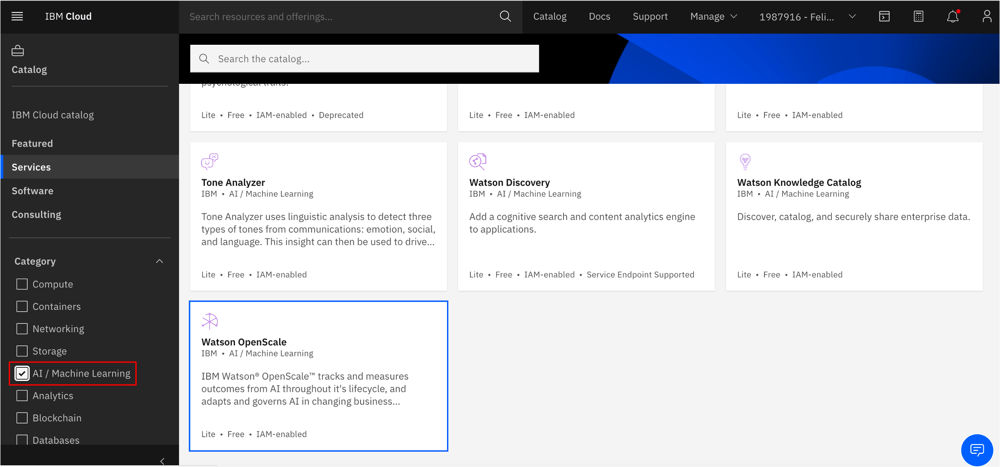
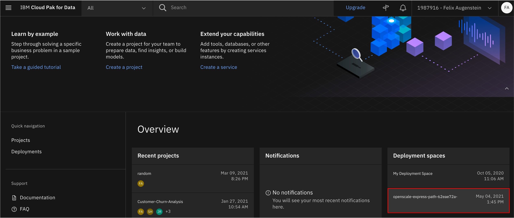

<h1 align="center" style="border-bottom: none;">:bar_chart: IBM Cloud Pak for Data Tutorial: Part VI</h1>
<h3 align="center">In this hands-on tutorial you will learn how Watson OpenScale can be used to monitor your deployed machine learning models</h3>

## Prerequisites

1. Sign up for an [IBM Cloud account](https://cloud.ibm.com/registration).
2. Fill in the required information and press the „Create Account“ button.
3. After you submit your registration, you will receive an e-mail from the IBM Cloud team with details about your account. In this e-mail, you will need to click the link provided to confirm your registration.
4. Now you should be able to login to your new IBM Cloud account ;-)

## Cloud Pak for Data Tutorials Part I to VI

This tutorial consists of 6 parts, you can start with part I or any other part, however, the necessary environment is set up in part I. 
[Part I - data visualization, preparation, and transformation](https://github.com/FelixAugenstein/cloud-pak-for-data-tutorial) 
[Part II - build and evaluate machine learning models by using AutoAI](https://github.com/FelixAugenstein/cloud-pak-for-data-tutorial-part-ii) 
[Part III - graphically build and evaluate machine learning models by using SPSS Modeler flow](https://github.com/FelixAugenstein/cloud-pak-for-data-tutorial-part-iii) 
[Part IV - set up and run Jupyter Notebooks to develop a machine learning model](https://github.com/FelixAugenstein/cloud-pak-for-data-tutorial-part-iv) 
[Part V - deploy a local Python app to test your model](https://github.com/FelixAugenstein/cloud-pak-for-data-tutorial-part-v) 
[Part VI - monitor your model with OpenScale](https://github.com/FelixAugenstein/cloud-pak-for-data-tutorial-part-vi)

The first 4 parts of this tutorial are based on the [Learning path: Getting started with Watson Studio](https://developer.ibm.com/series/learning-path-watson-studio/).

<h4>1) CRISP-DM</h4>
The <b>CR</b>oss <b>I</b>ndustry <b>S</b>tandard <b>P</b>rocess for <b>D</b>ata <b>M</b>ining is a model to display the cycle of a data science project. It consists of six phases: 
1. Business Understanding - What does the business need? 
2. Data Understanding - What data do we have and how is it made up of? 
3. Data Preparation - How can we structure the data for the modeling? 
4. Modeling - Which modeling techniques could apply? 
5. Evaluation - Which model is the most accurate? 
6. Deployment - How to implement the model? 

CRISP-DM is a continuous cycle. Deployed models can become less accurate over time, making precise predictions difficult. In order to trust machine learning models and artificial intelligence, deployed models need to be monitored to ensure aspects such as explainability, fairness, robustness, transparency and privacy. AI Ethics is a big topic, if you are interested you can find out more [here](https://www.ibm.com/artificial-intelligence/ethics).

## Set up Watson OpenScale

<h4>1) Create the OpenScale service</h4>

In your IBM Cloud account go to Catalog. Select the AI / Machine Learning category, then click Watson OpenScale. On the next page you can select the Lite Plan, it should cover all required features for this tutorial and you can also choose a region, ideally the region in which your previously created services run. Click "Create". 

<h4>2) Watson OpenScale Auto Setup</h4>

Click on the IBM Cloud logo in the upper left to get back to your dashboard. Then click services to select your Watson OpenScale service to get started.
If you are asked for Auto Setup you can select it, this will take about 10 minutes and set things up automatically for you.
When it says “All set!“ You can click „Let’s go“.

Note: After the Auto Setup is complete you have another Deployment Space for Watson OpenScale available in your Cloud Pak for Data as a Service.

<h4>3) Watson OpenScale Guided Tour</h4>

The automated setup ends with a guided tour, which highlights key features of Watson OpenScale as you move through the scenario by clicking Next (You can exit the tour at any point). When you finished the tour Watson OpenScale is completely set up and you can explore the UI on your own. 

The credit risk model was automatically deployed so that you have something to explore. This tutorial uses the credit risk model to help you explore the features of Watson OpenScale.
