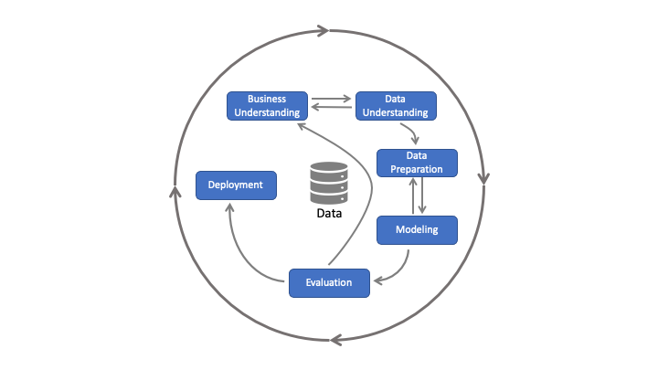

<h1 align="center" style="border-bottom: none;">:bar_chart: IBM Cloud Pak for Data Tutorial: Part VI</h1>
<h3 align="center">In this hands-on tutorial you will learn how Watson OpenScale can be used to monitor your deployed machine learning models</h3>

## Prerequisites

1. Sign up for an [IBM Cloud account](https://cloud.ibm.com/registration).
2. Fill in the required information and press the „Create Account“ button.
3. After you submit your registration, you will receive an e-mail from the IBM Cloud team with details about your account. In this e-mail, you will need to click the link provided to confirm your registration.
4. Now you should be able to login to your new IBM Cloud account ;-)

## Cloud Pak for Data Tutorials Part I to VI

This tutorial consists of 6 parts, you can start with part I or any other part, however, the necessary environment is set up in part I. 
[Part I - data visualization, preparation, and transformation](https://github.com/FelixAugenstein/cloud-pak-for-data-tutorial) 
[Part II - build and evaluate machine learning models by using AutoAI](https://github.com/FelixAugenstein/cloud-pak-for-data-tutorial-part-ii) 
[Part III - graphically build and evaluate machine learning models by using SPSS Modeler flow](https://github.com/FelixAugenstein/cloud-pak-for-data-tutorial-part-iii) 
[Part IV - set up and run Jupyter Notebooks to develop a machine learning model](https://github.com/FelixAugenstein/cloud-pak-for-data-tutorial-part-iv) 
[Part V - deploy a local Python app to test your model](https://github.com/FelixAugenstein/cloud-pak-for-data-tutorial-part-v) 
[Part VI - monitor your model with OpenScale](https://github.com/FelixAugenstein/cloud-pak-for-data-tutorial-part-vi)

This Watson OpenScale tutorial is based on the [Learning path: Getting started with Watson OpenScale](https://developer.ibm.com/tutorials/getting-started-with-watson-openscale/).

<h4>1) CRISP-DM</h4>
The <b>CR</b>oss <b>I</b>ndustry <b>S</b>tandard <b>P</b>rocess for <b>D</b>ata <b>M</b>ining is a model to display the cycle of a data science project. It consists of six phases: 
1. Business Understanding - What does the business need? 
2. Data Understanding - What data do we have and how is it made up of? 
3. Data Preparation - How can we structure the data for the modeling? 
4. Modeling - Which modeling techniques could apply? 
5. Evaluation - Which model is the most accurate? 
6. Deployment - How to implement the model? 

CRISP-DM is a continuous cycle. Deployed models can become less accurate over time, making precise predictions difficult. In order to trust machine learning models and artificial intelligence, deployed models need to be monitored to ensure aspects such as explainability, fairness, robustness, transparency and privacy. AI Ethics is a big topic, if you are interested you can find out more [here](https://www.ibm.com/artificial-intelligence/ethics).

## Set up Watson OpenScale

<h4>1) Create the OpenScale service</h4>

In your IBM Cloud account go to Catalog. Select the AI / Machine Learning category, then click Watson OpenScale. On the next page you can select the Lite Plan, it should cover all required features for this tutorial and you can also choose a region, ideally the region in which your previously created services run. Click "Create". 

<h4>2) Watson OpenScale Auto Setup</h4>

Click on the IBM Cloud logo in the upper left to get back to your dashboard. Then click services to select your Watson OpenScale service to get started.
If you are asked for Auto Setup you can select it, this will take about 10 minutes and set things up automatically for you.
When it says “All set!“ You can click „Let’s go“.

Note: After the Auto Setup is complete you have another Deployment Space for Watson OpenScale available in your Cloud Pak for Data as a Service.

<h4>3) Watson OpenScale Guided Tour</h4>

The automated setup ends with a guided tour, which highlights key features of Watson OpenScale as you move through the scenario by clicking Next (You can exit the tour at any point). The tour takes you through the 4 main areas of Watson OpenScale: Insights, Explanations, Configuration, and Support. In the image below you can see the first area Insights. When you finished the tour Watson OpenScale is completely set up and you can explore the UI on your own. 

## Data for this tutorial

The model used in this tutorial is a credit risk predictor, which was automatically deployed to OpenScale so that you have something to explore. The data set contains loan applicant data and is used to predict “Risk” or “No Risk”. The data includes two attributes that are considered sensitive: sex (gender) and age. Using Watson OpenScale with this model, you will be able to detect, explain and fix gender discrimination in the credit risk predictor.

## Monitor model fairness, quality and drift

For Fairness, Quality and Drift of the GermanCreditRiskModel you should see one or even more alerts each on your dashboard.
- Fairness monitor - looks for biased outcomes from your model. If there is a fairness issue, a warning icon appears.
- Quality monitor -  determines how well your model predicts outcomes. When quality monitoring is enabled, it generates a set of metrics every hour by default.
- Drift monitor - determines if the data the model is processing is causing a drop in accuracy or in data consistency over time.

<h4>1) Fairness</h4>

On your dashboard select the GermanCreditRiskModel tile to view more details about that deployment.
Notice the red alert indicators. You should see a red indicator under Fairness for Sex (female). This indicates that there has been an alert for the Fairness monitor. Alerts are configurable based on thresholds for fairness outcomes, which can be set and altered as needed.
Click on the Fairness score.

Use your mouse and hover over the chart to see the statistics for an individual hour. Click on the chart where the fairness score is lower.

You can choose the monitored attribute - for instance "Sex" - and the data set - for instance "Balanced". As you can see in the image the model is biased, because the monitored group female received favorable outcomes 28.0% of the time. The perfect equality is 56.0%. The fairness score for Sex in this case is 50.0% (28.0/56.0) (your data might vary). You can even click "View payload transactions" to explain individual predictions and inspect what feature values would result in a different outcome.

Now select the Debiased Data Set and click view details. As you can see the fairness for Sex and Age should be improved while the Quality remains the same. Click "View Debiased Endpoint". Watson OpenScale provides a scoring endpoint for this debiased model. Example code snippets are provided to help you use this debiased endpoint in your apps for further testing or production.

<h4>2) Quality</h4>

Instead of selecting a Fairness metric, use the left sidebar to select a Quality metric. As you can see in the image below, there was an alert for Area under ROC. 

The following table shows available Quality metrics.

Metric | Description
--- | ---
Area under ROC | Area under recall and false positive rate curve.
Area under PR | Area under precision and recall curve.
Accuracy | Accuracy is proportion of correct predictions.
True positive rate (TPR) | Proportion of correct predictions in predictions of positive class.
False positive rate (FPR) | Proportion of incorrect predictions in positive class.
Recall | Proportion of correct predictions in positive class.
Precision | Proportion of correct predictions in predictions of positive class.
F1-Measure | Harmonic mean of precision and recall.
Logarithmic loss | Mean of logarithms target class probabilities (confidence). It is also known as Expected log-likelihood.

<h4>3) Drift</h4>

Even if you start with a great training data set and create a fair and accurate model, over time your training data may become a less appropriate example of real world decisions. Watson OpenScale uses drift detection to warn you and help you update your model to be more relevant.
To see drift in accuracy and data consistency over time, use the left sidebar to select Drop in accuracy.

Watson OpenScale uses drift detection to alert you when there is a drift in accuracy or a drift in data consistency.

- A drift in data consistency indicates that the runtime data is not consistent with the training data.
- A drift in accuracy indicates an increase in transactions similar to those that did not evaluate correctly during training.

You can click on the chart at a point in time that shows a drop in accuracy to see the transactions that contributed to drift.
Watson OpenScale analyzes all transactions to find the ones that contribute to drift. It then groups the transactions based on the similarity of each feature’s contribution to the drift. In each group, Watson OpenScale also estimates the important features that played a major role in the drift in accuracy and classifies their feature impact as large, some, and small. In order to fix drift a good place to start is with new data regarding features that have a large impact on drift in accuracy.

## If you have any questions just contact me
Felix Augenstein 
Digital Tech Ecosystem & Developer Representative @IBM 
Twitter: [@F_Augenstein](https://twitter.com/F_Augenstein) 
LinkedIn: [linkedin.com/in/felixaugenstein](https://www.linkedin.com/in/felixaugenstein/)
